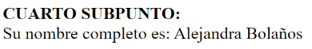

# Taller-10
<h1>Taller 10 - Alejandra Bolaños Ladron de Guevara</h1>
<h2>Curso: Full stack básico - Grupo 1</h2>

Profesor: Cristian Patiño

<h3>Punto 1: Constantes y variables</h3>

<h3>Punto 2: Suma de constantes y variables</h3>

<h3>Punto 3: Suma de dos números indicados por el usuario</h3>

<h3>Punto 4: Datos de usuario en consola</h3>

<h3>Punto 5: Entrada de bolera usando if/else</h3>

<h3>Punto 6: Detección de mayoría de edad</h3>

    
<h3>Punto 7: Selección de operación aritmética</h3>

      
<h3>Punto 8: Entrada de bolera usando 'switch'</h3>

     
<h3>Punto 9: Tabla de multiplicar usando 'while'</h3>

 
<h3>Punto 10: Números pares usando 'while'</h3>

 
<h3>Punto 11: Números impares usando 'while'</h3>

 
<h3>Punto 12: Tabla de multiplicar usando 'for'</h3>

 
<h3>Punto 13: Suma de valores de un arreglo usando 'foreach'</h3>

 
<h3>Punto 14: Revisión de contraseña</h3>

 
<h3>Punto 15: Selección de operación aritmética usando funciones</h3>

 